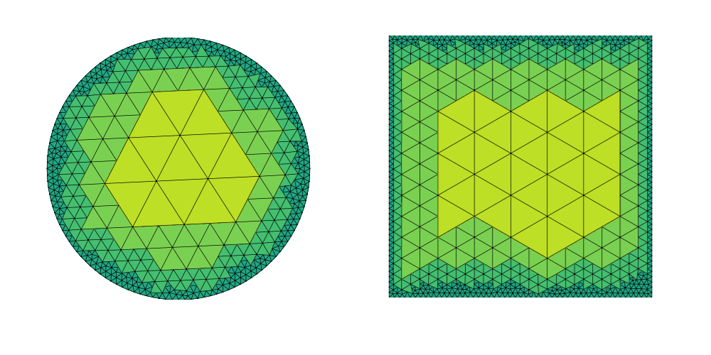
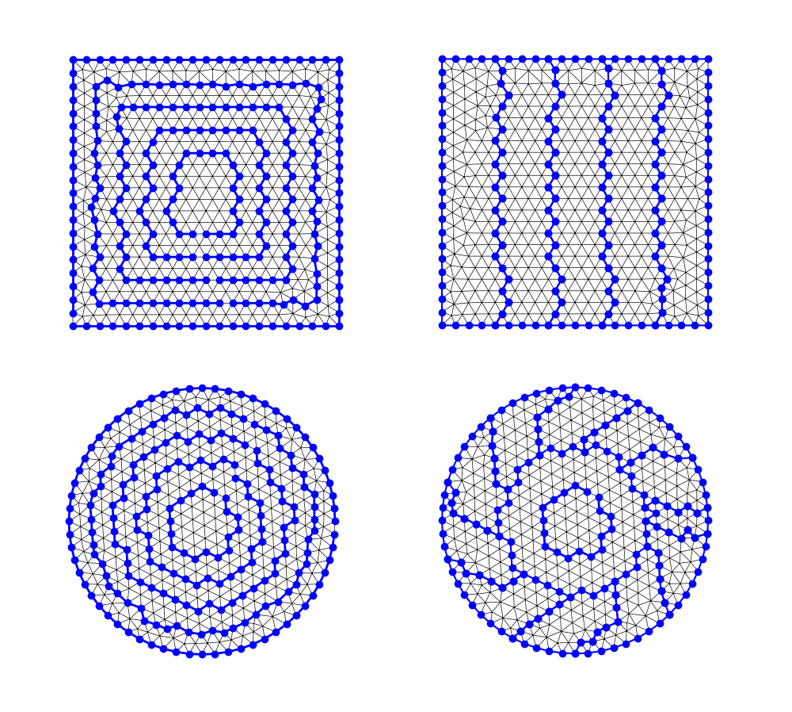

# triellipt
An adaptive finite-element solver for elliptic PDEs.

## Status

- Currently under development.
- Expected release in early 2025.
- Funded by the German Research Foundation (DFG) —
  Project number [515939493](https://gepris-extern.dfg.de/gepris/projekt/515939493?language=en)

## Demos

Here are first demos of computational meshes:

### Hierarchical triangulations

### Static mesh partitions

